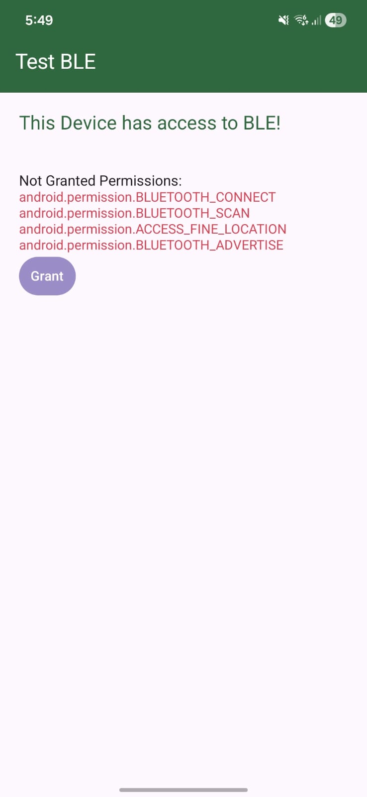
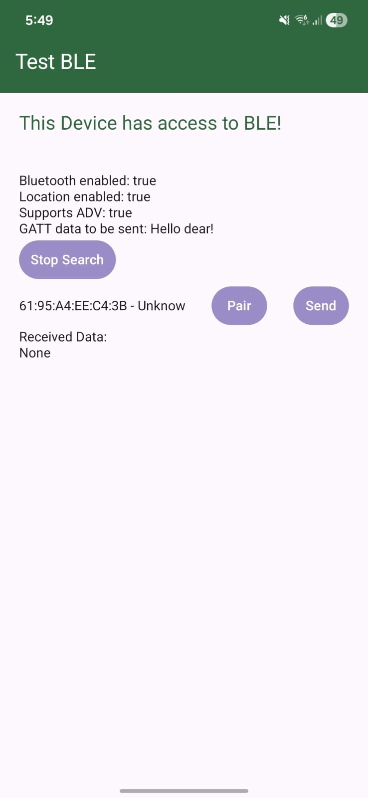
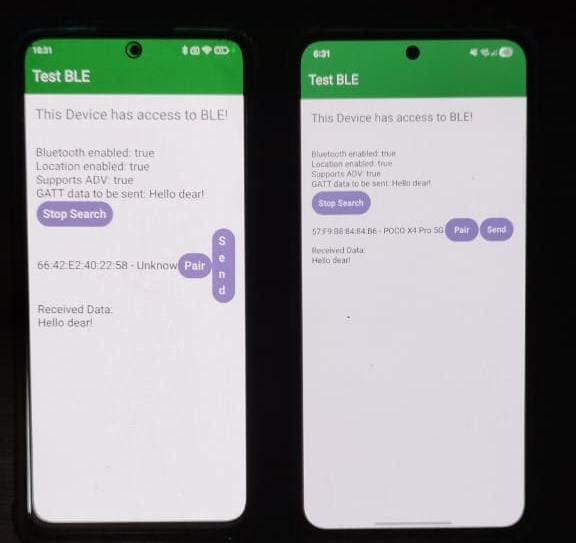

# TEST BLE

This is a simple project testing BLUETOOTH/BLE connections between android
devices via GATT server.

The app is not production ready, only a simple application to send a small chunck of data between devices.

  
  

You can find a debug ready apk at:[https://github.com/Dpbm/test-ble/releases/tag/V0.0.1](https://github.com/Dpbm/test-ble/releases/tag/V0.0.1)

